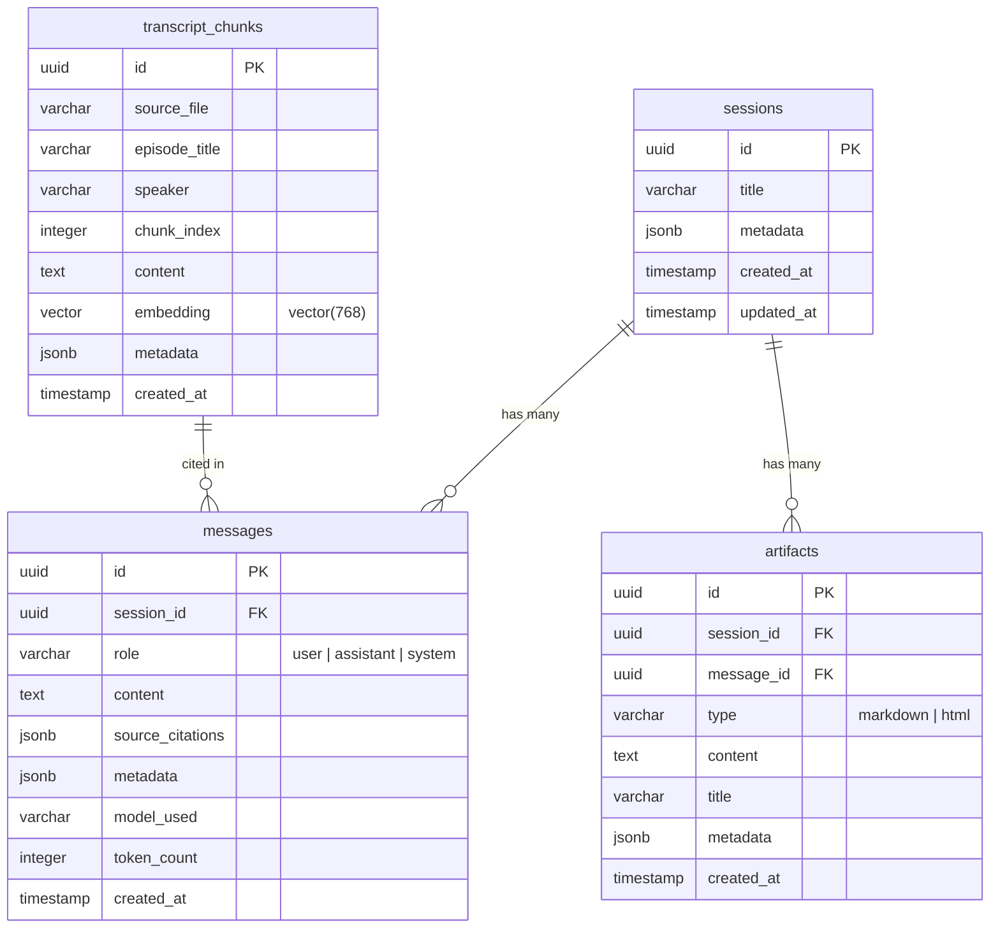
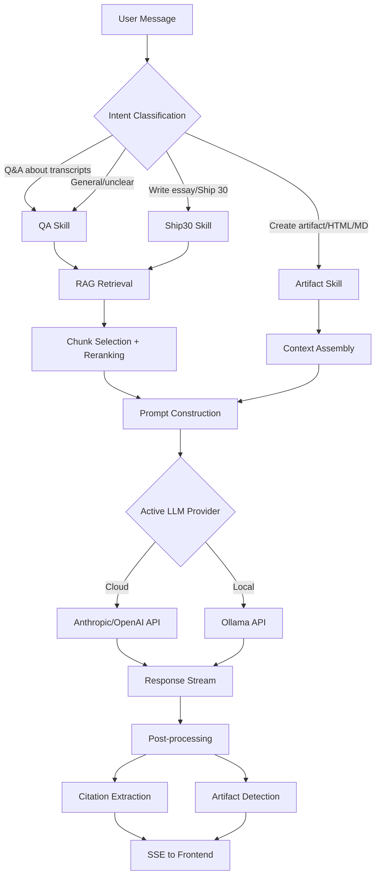

# 🏗️ Architecture Document

## The Lenny Growth Assistant

---

## 1. System Overview

The Lenny Growth Assistant is a three-tier application with a clear separation of concerns:

```
┌─────────────────────┐     ┌─────────────────────┐     ┌─────────────────────┐
│   Presentation      │     │   Application       │     │   Data              │
│   (React + Vite)    │────▶│   (FastAPI + Agent)  │────▶│   (PostgreSQL +     │
│                     │ SSE │                     │     │    pgvector)        │
└─────────────────────┘     └─────────────────────┘     └─────────────────────┘
                                     │
                            ┌────────┴────────┐
                            │  LLM Providers  │
                            │  ┌───────────┐  │
                            │  │ Anthropic  │  │
                            │  │ OpenAI     │  │
                            │  │ Ollama     │  │
                            │  └───────────┘  │
                            └─────────────────┘
```

---

## 2. Component Architecture

### 2.1 Frontend Architecture

```
frontend/src/
├── App.tsx                    # Root component, layout manager
├── main.tsx                   # Entry point, provider setup
│
├── components/
│   ├── Chat/
│   │   ├── ChatWindow.tsx     # Main chat container, message list
│   │   ├── MessageBubble.tsx  # Individual message (user/assistant)
│   │   ├── InputBar.tsx       # Message input with send button
│   │   ├── SourceCitation.tsx # Clickable source references
│   │   ├── StreamingDots.tsx  # Typing indicator during SSE
│   │   └── WelcomeScreen.tsx  # Empty state with prompts
│   │
│   ├── Sidebar/
│   │   ├── SessionList.tsx    # List of chat sessions
│   │   ├── SessionItem.tsx    # Individual session entry
│   │   ├── NewChatButton.tsx  # Create new session
│   │   └── SettingsPanel.tsx  # LLM provider toggle, config
│   │
│   ├── Artifacts/
│   │   ├── ArtifactViewer.tsx # Side panel artifact renderer
│   │   ├── ArtifactSandbox.tsx# Sandboxed iframe for HTML
│   │   ├── MarkdownRenderer.tsx# Markdown rendering component
│   │   └── ArtifactToolbar.tsx# Copy, download, close actions
│   │
│   └── common/
│       ├── Button.tsx
│       ├── Modal.tsx
│       ├── Toast.tsx
│       ├── Spinner.tsx
│       └── ErrorBoundary.tsx
│
├── hooks/
│   ├── useChat.ts             # Chat state & SSE streaming
│   ├── useSessions.ts         # Session CRUD operations
│   ├── useArtifacts.ts        # Artifact state management
│   └── useConfig.ts           # LLM provider config
│
├── services/
│   ├── api.ts                 # Axios/fetch API client
│   ├── sse.ts                 # SSE stream handler
│   └── storage.ts             # Local storage helpers
│
├── stores/
│   └── appStore.ts            # Zustand global state
│
├── types/
│   ├── chat.ts                # Message, Session types
│   ├── artifact.ts            # Artifact types
│   └── config.ts              # Config types
│
└── styles/
    ├── globals.css             # CSS variables, reset
    ├── chat.css                # Chat-specific styles
    ├── sidebar.css             # Sidebar styles
    └── artifacts.css           # Artifact viewer styles
```

#### Key Design Decisions (Frontend)

1. **State Management**: Zustand for lightweight global state (active session, provider, artifacts). React Query for server state (sessions list, messages).
2. **SSE Streaming**: Native `EventSource` API wrapped in a custom hook for streaming LLM responses. Falls back to polling if SSE is unavailable.
3. **Artifact Sandboxing**: HTML artifacts rendered in `<iframe sandbox="allow-same-origin">` with DOMPurify sanitization. No `allow-scripts` — generated JavaScript is stripped.
4. **Responsive Layout**: CSS Grid with a collapsible sidebar (mobile: bottom sheet) and artifact panel (mobile: full-screen overlay).

---

### 2.2 Backend Architecture

```
backend/app/
├── main.py                    # FastAPI app, middleware, startup/shutdown
├── config.py                  # Pydantic Settings (env vars)
│
├── api/
│   ├── routes/
│   │   ├── chat.py            # POST /api/chat (SSE streaming)
│   │   ├── sessions.py        # CRUD /api/sessions
│   │   ├── artifacts.py       # POST/GET /api/artifacts
│   │   ├── config.py          # GET/POST /api/config/provider
│   │   └── health.py          # GET /health
│   │
│   ├── middleware/
│   │   ├── cors.py            # CORS configuration
│   │   ├── logging.py         # Request/response logging
│   │   └── error_handler.py   # Global exception handler
│   │
│   └── deps.py                # Dependency injection (DB, Agent, etc.)
│
├── agent/
│   ├── orchestrator.py        # Routes messages to appropriate skills
│   │
│   ├── skills/
│   │   ├── base_skill.py      # Abstract skill interface
│   │   ├── qa_skill.py        # Grounded Q&A (RAG)
│   │   ├── ship30_skill.py    # Ship 30 for 30 essay generation
│   │   └── artifact_skill.py  # Markdown/HTML artifact creation
│   │
│   └── providers/
│       ├── base.py            # Abstract LLM provider interface
│       ├── anthropic.py       # Anthropic Claude integration
│       ├── openai_provider.py # OpenAI GPT integration
│       ├── ollama.py          # Ollama local model integration
│       └── factory.py         # Provider factory (config-driven)
│
├── rag/
│   ├── embeddings.py          # Embedding generation (multi-provider)
│   ├── retriever.py           # Vector search + similarity scoring
│   ├── chunker.py             # Text splitting (recursive character)
│   ├── reranker.py            # Cross-encoder reranking (optional)
│   └── ingestion.py           # Transcript loading & indexing pipeline
│
├── db/
│   ├── database.py            # AsyncSession factory, connection pool
│   ├── models.py              # SQLAlchemy ORM models
│   └── repositories/
│       ├── session_repo.py    # Session CRUD
│       ├── message_repo.py    # Message CRUD
│       ├── artifact_repo.py   # Artifact CRUD
│       └── transcript_repo.py # Transcript chunk queries
│
├── schemas/
│   ├── chat.py                # ChatRequest, ChatResponse, MessageSchema
│   ├── session.py             # SessionCreate, SessionResponse
│   ├── artifact.py            # ArtifactCreate, ArtifactResponse
│   ├── config.py              # ProviderConfig, ProviderSwitch
│   └── common.py              # ErrorResponse, HealthResponse
│
└── scripts/
    ├── ingest_transcripts.py  # One-time transcript ingestion
    └── seed_data.py           # Optional seed data for demo
```

#### Key Design Decisions (Backend)

1. **Async Everything**: All database operations use `asyncpg` via SQLAlchemy async. All LLM calls are async. This allows high concurrency under FastAPI's async event loop.
2. **Repository Pattern**: Data access is abstracted behind repository classes, making it easy to swap storage backends and test with mocks.
3. **Provider Factory**: LLM providers are instantiated via a factory pattern driven by configuration. Adding a new provider requires implementing the abstract interface and registering it.
4. **Skill-Based Agent**: The orchestrator inspects user intent (via keyword matching + LLM classification) and routes to the appropriate skill. Each skill has its own system prompt, retrieval strategy, and output format.

---

## 3. Database Schema

### 3.1 Entity Relationship Diagram



### 3.2 Table Details

#### `sessions`
```sql
CREATE TABLE sessions (
    id UUID PRIMARY KEY DEFAULT gen_random_uuid(),
    title VARCHAR(255) DEFAULT 'New Chat',
    metadata JSONB DEFAULT '{}',
    created_at TIMESTAMP WITH TIME ZONE DEFAULT NOW(),
    updated_at TIMESTAMP WITH TIME ZONE DEFAULT NOW()
);

CREATE INDEX idx_sessions_created_at ON sessions(created_at DESC);
```

#### `messages`
```sql
CREATE TABLE messages (
    id UUID PRIMARY KEY DEFAULT gen_random_uuid(),
    session_id UUID NOT NULL REFERENCES sessions(id) ON DELETE CASCADE,
    role VARCHAR(20) NOT NULL CHECK (role IN ('user', 'assistant', 'system')),
    content TEXT NOT NULL,
    source_citations JSONB DEFAULT '[]',
    metadata JSONB DEFAULT '{}',
    model_used VARCHAR(100),
    token_count INTEGER DEFAULT 0,
    created_at TIMESTAMP WITH TIME ZONE DEFAULT NOW()
);

CREATE INDEX idx_messages_session_id ON messages(session_id);
CREATE INDEX idx_messages_created_at ON messages(session_id, created_at);
```

#### `artifacts`
```sql
CREATE TABLE artifacts (
    id UUID PRIMARY KEY DEFAULT gen_random_uuid(),
    session_id UUID NOT NULL REFERENCES sessions(id) ON DELETE CASCADE,
    message_id UUID REFERENCES messages(id) ON DELETE SET NULL,
    type VARCHAR(20) NOT NULL CHECK (type IN ('markdown', 'html')),
    content TEXT NOT NULL,
    title VARCHAR(255) DEFAULT 'Untitled Artifact',
    metadata JSONB DEFAULT '{}',
    created_at TIMESTAMP WITH TIME ZONE DEFAULT NOW()
);

CREATE INDEX idx_artifacts_session_id ON artifacts(session_id);
```

#### `transcript_chunks`
```sql
CREATE EXTENSION IF NOT EXISTS vector;

CREATE TABLE transcript_chunks (
    id UUID PRIMARY KEY DEFAULT gen_random_uuid(),
    source_file VARCHAR(500) NOT NULL,
    episode_title VARCHAR(500),
    speaker VARCHAR(255),
    chunk_index INTEGER NOT NULL,
    content TEXT NOT NULL,
    embedding vector(768),
    metadata JSONB DEFAULT '{}',
    created_at TIMESTAMP WITH TIME ZONE DEFAULT NOW()
);

CREATE INDEX idx_chunks_source ON transcript_chunks(source_file);
CREATE INDEX idx_chunks_embedding ON transcript_chunks 
    USING ivfflat (embedding vector_cosine_ops) WITH (lists = 100);
```

---

## 4. API Endpoints

### 4.1 Health

```
GET /health
Response 200:
{
  "status": "healthy",
  "database": "connected",
  "llm_provider": "ollama",
  "llm_model": "llama3.2",
  "llm_status": "available",
  "retrieval_engine": "ready",
  "transcript_count": 150,
  "timestamp": "2026-08-24T12:00:00Z"
}
```

### 4.2 Sessions

```
POST /api/sessions
Request: { "title": "optional title" }
Response 201: { "id": "uuid", "title": "New Chat", "created_at": "..." }

GET /api/sessions
Response 200: [ { "id": "uuid", "title": "...", "message_count": 5, "created_at": "..." } ]

GET /api/sessions/{session_id}
Response 200: { "id": "uuid", "title": "...", "messages": [...], "artifacts": [...] }

DELETE /api/sessions/{session_id}
Response 204: No Content
```

### 4.3 Chat

```
POST /api/chat
Content-Type: application/json
Request:
{
  "session_id": "uuid",
  "message": "What does Lenny say about product-market fit?",
  "stream": true
}

Response (SSE):
event: message_start
data: {"message_id": "uuid"}

event: content_delta
data: {"delta": "Based on Lenny's podcast"}

event: content_delta
data: {"delta": " episode with Rahul Vohra..."}

event: source_citations
data: {"citations": [{"source": "ep-123-rahul-vohra.md", "episode": "Finding PMF", "excerpt": "..."}]}

event: message_end
data: {"token_count": 450, "model": "llama3.2"}
```

### 4.4 Artifacts

```
POST /api/artifacts
Request:
{
  "session_id": "uuid",
  "type": "html",
  "prompt": "Create an HTML summary of growth frameworks discussed",
  "context_message_ids": ["uuid1", "uuid2"]
}
Response 201:
{
  "id": "uuid",
  "type": "html",
  "title": "Growth Frameworks Summary",
  "content": "<div>...</div>",
  "created_at": "..."
}

GET /api/artifacts/{artifact_id}
Response 200: { "id": "uuid", "type": "html", "content": "...", "title": "..." }
```

### 4.5 Configuration

```
GET /api/config/provider
Response 200:
{
  "active_provider": "ollama",
  "active_model": "llama3.2",
  "available_providers": [
    { "name": "ollama", "status": "available", "models": ["llama3.2", "mistral"] },
    { "name": "anthropic", "status": "configured", "models": ["claude-sonnet-4-20250514"] },
    { "name": "openai", "status": "not_configured", "models": [] }
  ]
}

POST /api/config/provider
Request: { "provider": "anthropic", "model": "claude-sonnet-4-20250514" }
Response 200: { "active_provider": "anthropic", "active_model": "claude-sonnet-4-20250514" }
```

---

## 5. Agent Architecture

### 5.1 Orchestration Flow



### 5.2 Skill Interface

```python
from abc import ABC, abstractmethod
from typing import AsyncGenerator

class BaseSkill(ABC):
    """Abstract base class for all agent skills."""
    
    @property
    @abstractmethod
    def name(self) -> str:
        """Unique skill identifier."""
        pass
    
    @property
    @abstractmethod
    def description(self) -> str:
        """Human-readable skill description for routing."""
        pass
    
    @property
    @abstractmethod
    def system_prompt(self) -> str:
        """System prompt template for this skill."""
        pass
    
    @abstractmethod
    async def execute(
        self, 
        query: str, 
        context: list[dict],
        retrieved_chunks: list[dict]
    ) -> AsyncGenerator[str, None]:
        """Execute the skill and yield response chunks."""
        pass
    
    @abstractmethod
    def detect_intent(self, message: str) -> float:
        """Return confidence score (0-1) that this skill should handle the message."""
        pass
```

### 5.3 LLM Provider Interface

```python
from abc import ABC, abstractmethod
from typing import AsyncGenerator

class BaseLLMProvider(ABC):
    """Abstract interface for LLM providers."""
    
    @abstractmethod
    async def generate(
        self,
        messages: list[dict],
        system_prompt: str,
        max_tokens: int = 4096,
        temperature: float = 0.7,
        stream: bool = True
    ) -> AsyncGenerator[str, None]:
        """Generate a response, yielding chunks if streaming."""
        pass
    
    @abstractmethod
    async def embed(self, text: str) -> list[float]:
        """Generate an embedding vector for the given text."""
        pass
    
    @abstractmethod
    async def health_check(self) -> bool:
        """Check if the provider is available."""
        pass
    
    @property
    @abstractmethod
    def name(self) -> str:
        pass
    
    @property
    @abstractmethod
    def model(self) -> str:
        pass
```

---

## 6. RAG / Retrieval Pipeline

### 6.1 Ingestion Flow

```
Transcript Files (.md)
        │
        ▼
┌──────────────────┐
│  Load & Parse    │  Read markdown, extract metadata (episode, speaker)
└────────┬─────────┘
         │
         ▼
┌──────────────────┐
│  Clean & Normalize│  Remove artifacts, normalize whitespace
└────────┬─────────┘
         │
         ▼
┌──────────────────┐
│  Chunk           │  Recursive character splitter (500 tokens, 50 overlap)
└────────┬─────────┘
         │
         ▼
┌──────────────────┐
│  Embed           │  Generate vector embeddings (768-dim)
└────────┬─────────┘
         │
         ▼
┌──────────────────┐
│  Store           │  Insert into transcript_chunks with metadata
└──────────────────┘
```

### 6.2 Retrieval Flow

```
User Query
    │
    ▼
┌──────────────────┐
│  Embed Query     │  Same embedding model as ingestion
└────────┬─────────┘
         │
         ▼
┌──────────────────┐
│  Vector Search   │  pgvector cosine similarity, top-20
└────────┬─────────┘
         │
         ▼
┌──────────────────┐
│  Rerank (opt.)   │  Cross-encoder reranking, top-5
└────────┬─────────┘
         │
         ▼
┌──────────────────┐
│  Format Context  │  Construct prompt with retrieved chunks + metadata
└──────────────────┘
```

### 6.3 Configuration

```python
# Retrieval configuration
RETRIEVAL_CONFIG = {
    "chunk_size": 500,           # tokens per chunk
    "chunk_overlap": 50,         # overlap between chunks
    "top_k_retrieval": 20,       # initial retrieval count
    "top_k_rerank": 5,           # final context count
    "similarity_threshold": 0.3, # minimum cosine similarity
    "embedding_model": "nomic-embed-text",  # Ollama embed model
    "vector_dimension": 768
}
```

---

## 7. Security Architecture

### 7.1 Artifact Sandboxing

Generated HTML artifacts are treated as **untrusted content**. The isolation strategy:

1. **DOMPurify Sanitization**: Before rendering, all HTML passes through DOMPurify to strip:
   - `<script>` tags and inline event handlers (`onclick`, `onerror`, etc.)
   - `javascript:` protocol URLs
   - `<iframe>`, `<object>`, `<embed>` tags
   - Data exfiltration vectors (`` with strict sandbox attributes:
   ```html
   <iframe 
     sandbox="allow-same-origin" 
     csp="default-src 'none'; style-src 'unsafe-inline'; img-src data:"
     srcdoc="..."
   />
   ```
   - **Permits**: Inline CSS styling, data: URIs for images
   - **Blocks**: JavaScript execution, form submission, navigation, popups, external resource loading

3. **Content Security Policy**: Backend sets CSP headers on artifact responses:
   ```
   Content-Security-Policy: default-src 'none'; style-src 'unsafe-inline'; img-src data:
   ```

### 7.2 Input Validation

- All API inputs validated via Pydantic models
- Maximum message length: 10,000 characters
- Session IDs validated as UUID format
- SQL injection prevented by parameterized queries (SQLAlchemy ORM)

### 7.3 Secret Management

- All secrets loaded from environment variables
- `.env` files in `.gitignore`
- `.env.example` contains only placeholder values
- No secrets in Docker images or logs

---

## 8. Deployment Topology

### 8.1 Docker Compose Architecture

```yaml
services:
  frontend:
    build: ./frontend
    ports: ["5173:5173"]
    depends_on: [backend]

  backend:
    build: ./backend
    ports: ["8000:8000"]
    depends_on: [postgres]
    env_file: .env
    volumes:
      - ./data/transcripts:/app/data/transcripts

  postgres:
    image: pgvector/pgvector:pg16
    ports: ["5432:5432"]
    volumes:
      - pgdata:/var/lib/postgresql/data
    environment:
      POSTGRES_DB: lenny_assistant
      POSTGRES_USER: postgres
      POSTGRES_PASSWORD: postgres

volumes:
  pgdata:
```

### 8.2 External Dependencies

| Service | Connection | Failure Mode |
| ------- | ---------- | ------------ |
| PostgreSQL | TCP 5432 | App fails to start; health check reports `database: disconnected` |
| Ollama | HTTP 11434 | Graceful fallback to cloud provider; warning in UI |
| Anthropic API | HTTPS 443 | Fallback to next provider; structured error logged |
| OpenAI API | HTTPS 443 | Fallback to next provider; structured error logged |

---

## 9. Observability

### 9.1 Structured Logging

All logs use JSON format for machine parsing:

```json
{
  "timestamp": "2026-08-24T12:00:00Z",
  "level": "INFO",
  "logger": "app.agent.orchestrator",
  "message": "Skill executed successfully",
  "context": {
    "session_id": "abc-123",
    "skill": "qa_skill",
    "provider": "ollama",
    "model": "llama3.2",
    "retrieval_chunks": 5,
    "token_count": 450,
    "latency_ms": 3200
  }
}
```

### 9.2 Logging Categories

| Category | What is Logged |
| -------- | -------------- |
| **API** | Request method, path, status code, latency, client IP |
| **Agent** | Skill selection, intent confidence, execution time |
| **RAG** | Query embedding time, retrieval count, similarity scores |
| **LLM** | Provider, model, token usage, latency, errors |
| **Database** | Connection events, query timing, migration status |
| **Artifacts** | Type, size, sanitization actions taken |

### 9.3 Health Check Aggregation

The `/health` endpoint aggregates component status:

```python
{
    "status": "healthy" | "degraded" | "unhealthy",
    "components": {
        "database": {"status": "up", "latency_ms": 2},
        "llm_provider": {"status": "up", "provider": "ollama", "model": "llama3.2"},
        "retrieval": {"status": "up", "indexed_chunks": 15000},
    },
    "timestamp": "2026-08-24T12:00:00Z"
}
```
