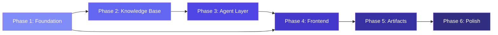

# 📦 Development Phases

## The Lenny Growth Assistant — Phased Implementation Plan

---

## Overview

This document breaks the entire build into **6 sequential phases**, each self-contained and testable. Each phase produces a working increment. Complete one phase before moving to the next.

**Total Estimated Time: 16–21 hours**

```
Phase 1 ─────► Phase 2 ─────► Phase 3 ─────► Phase 4 ─────► Phase 5 ─────► Phase 6
Foundation     Knowledge      Agent          Frontend       Artifacts      Polish &
& Infra        Base & RAG     Layer          & Chat UI      System         Deploy
(2-3 hrs)      (3-4 hrs)      (3-4 hrs)      (3-4 hrs)      (2-3 hrs)      (2-3 hrs)
```

---

## Phase 1: Foundation & Infrastructure

**Goal:** Establish project scaffolding, database, Docker setup, and configuration layer.

**Duration:** 2–3 hours

### 1.1 Tasks

| # | Task | File(s) | Description |
|---|------|---------|-------------|
| 1.1.1 | Initialize project structure | `./` | Create directory tree: `backend/`, `frontend/`, `data/`, `docs/` |
| 1.1.2 | Backend scaffolding | `backend/` | Python venv, `requirements.txt`, FastAPI app skeleton |
| 1.1.3 | Configuration layer | `backend/app/config.py` | Pydantic Settings with all env vars (LLM, DB, RAG, App) |
| 1.1.4 | Environment template | `.env.example` | All variables with safe defaults and documentation comments |
| 1.1.5 | Database setup | `backend/app/db/` | SQLAlchemy async engine, models (sessions, messages, artifacts, transcript_chunks) |
| 1.1.6 | Alembic migrations | `backend/alembic/` | Initial migration with pgvector extension and all tables |
| 1.1.7 | Health endpoint | `backend/app/api/routes/health.py` | Returns DB status, LLM provider status, system info |
| 1.1.8 | Global middleware | `backend/app/api/middleware/` | CORS, structured logging, global error handler |
| 1.1.9 | Docker Compose | `docker-compose.yml` | PostgreSQL (pgvector image), backend, frontend services |
| 1.1.10 | Dockerfile (backend) | `backend/Dockerfile` | Python 3.11 slim, multi-stage build |
| 1.1.11 | Frontend scaffolding | `frontend/` | Vite + React + TypeScript initialization |
| 1.1.12 | Dockerfile (frontend) | `frontend/Dockerfile` | Node 18, multi-stage build |

### 1.2 Deliverable

```bash
# After Phase 1, you can:
docker compose up --build
# → PostgreSQL running with pgvector
# → FastAPI running at http://localhost:8000
# → GET /health returns { "status": "healthy", "database": "connected" }
# → Frontend scaffold at http://localhost:5173
```

### 1.3 Acceptance Criteria

- [ ] `docker compose up` starts all services without errors
- [ ] `/health` returns `200 OK` with database status
- [ ] `.env.example` documents all required/optional variables
- [ ] Alembic migration creates all 4 tables (sessions, messages, artifacts, transcript_chunks)
- [ ] pgvector extension is enabled
- [ ] Structured JSON logging works for API requests
- [ ] Global error handler returns consistent error format

### 1.4 Dependencies

- Docker & Docker Compose installed
- PostgreSQL pgvector Docker image: `pgvector/pgvector:pg16`

---

## Phase 2: Knowledge Base & RAG Pipeline

**Goal:** Ingest Lenny's Podcast transcripts, generate embeddings, and implement vector search.

**Duration:** 3–4 hours

### 2.1 Tasks

| # | Task | File(s) | Description |
|---|------|---------|-------------|
| 2.1.1 | Download transcripts | `data/transcripts/` | Clone/download from `ChatPRD/lennys-podcast-transcripts` or official repo |
| 2.1.2 | Transcript parser | `backend/app/rag/ingestion.py` | Load markdown files, extract metadata (episode title, speaker) |
| 2.1.3 | Text chunker | `backend/app/rag/chunker.py` | Recursive character splitter (500 tokens, 50 overlap) |
| 2.1.4 | Embedding service | `backend/app/rag/embeddings.py` | Multi-provider embedding (Ollama `nomic-embed-text`, OpenAI, fallback) |
| 2.1.5 | Ingestion script | `backend/app/scripts/ingest_transcripts.py` | CLI script: load → chunk → embed → store in pgvector |
| 2.1.6 | Vector retriever | `backend/app/rag/retriever.py` | pgvector cosine similarity search with scoring |
| 2.1.7 | Transcript repository | `backend/app/db/repositories/transcript_repo.py` | CRUD for transcript_chunks table |
| 2.1.8 | Ingestion tests | `backend/tests/test_rag/` | Test chunker, embedding dimensions, retrieval accuracy |
| 2.1.9 | Search endpoint (debug) | `backend/app/api/routes/search.py` | Temporary debug endpoint: `POST /api/search` to test retrieval |

### 2.2 Deliverable

```bash
# After Phase 2, you can:
python -m app.scripts.ingest_transcripts
# → Transcripts are chunked and embedded in PostgreSQL

curl -X POST http://localhost:8000/api/search \
  -H "Content-Type: application/json" \
  -d '{"query": "product market fit"}'
# → Returns top-k relevant transcript chunks with similarity scores
```

### 2.3 Acceptance Criteria

- [ ] Transcripts are loaded from `data/transcripts/` directory
- [ ] Text is chunked into ~500 token segments with 50 token overlap
- [ ] Embeddings are generated via Ollama (`nomic-embed-text`) and stored as pgvector
- [ ] `POST /api/search` returns relevant chunks with similarity scores > 0.3
- [ ] Metadata (episode title, speaker) is preserved per chunk
- [ ] Ingestion is idempotent (re-running doesn't duplicate data)
- [ ] Chunker unit tests pass (correct chunk sizes, overlap)
- [ ] Ingestion handles missing/malformed files gracefully

### 2.4 Dependencies

- Phase 1 complete (database running with pgvector)
- Ollama running with `nomic-embed-text` model pulled
- Transcript files in `data/transcripts/`

---

## Phase 3: Agent Layer & Skills

**Goal:** Implement the agent orchestrator, LLM provider abstraction, and all three skills (QA, Ship 30, Artifact).

**Duration:** 3–4 hours

### 3.1 Tasks

| # | Task | File(s) | Description |
|---|------|---------|-------------|
| 3.1.1 | LLM provider interface | `backend/app/agent/providers/base.py` | Abstract base class: generate, embed, health_check |
| 3.1.2 | Ollama provider | `backend/app/agent/providers/ollama.py` | HTTP streaming to Ollama API |
| 3.1.3 | Anthropic provider | `backend/app/agent/providers/anthropic.py` | Anthropic SDK streaming integration |
| 3.1.4 | OpenAI provider | `backend/app/agent/providers/openai_provider.py` | OpenAI SDK streaming integration |
| 3.1.5 | Provider factory | `backend/app/agent/providers/factory.py` | Config-driven provider instantiation + fallback chain |
| 3.1.6 | Base skill interface | `backend/app/agent/skills/base_skill.py` | Abstract class: name, system_prompt, detect_intent, execute |
| 3.1.7 | QA Skill | `backend/app/agent/skills/qa_skill.py` | Grounded Q&A with RAG context, citations, "I don't know" |
| 3.1.8 | Ship 30 Skill | `backend/app/agent/skills/ship30_skill.py` | Essay generation with Ship 30 for 30 framework |
| 3.1.9 | Artifact Skill | `backend/app/agent/skills/artifact_skill.py` | Markdown/HTML artifact generation |
| 3.1.10 | Agent orchestrator | `backend/app/agent/orchestrator.py` | Intent classification, skill routing, streaming |
| 3.1.11 | Chat API endpoint | `backend/app/api/routes/chat.py` | SSE streaming chat endpoint |
| 3.1.12 | Session API | `backend/app/api/routes/sessions.py` | Session CRUD endpoints |
| 3.1.13 | Config API | `backend/app/api/routes/config.py` | Provider switch endpoint |
| 3.1.14 | Agent tests | `backend/tests/test_agent/` | Intent detection, skill routing, provider fallback |

### 3.2 Deliverable

```bash
# After Phase 3, you can:

# Create a session
curl -X POST http://localhost:8000/api/sessions

# Chat with streaming (via curl SSE)
curl -N -X POST http://localhost:8000/api/chat \
  -H "Content-Type: application/json" \
  -d '{"session_id": "...", "message": "What does Lenny say about PMF?", "stream": true}'
# → Streams grounded answer with source citations

# Switch provider
curl -X POST http://localhost:8000/api/config/provider \
  -H "Content-Type: application/json" \
  -d '{"provider": "anthropic"}'
```

### 3.3 Acceptance Criteria

- [ ] QA Skill answers questions using transcript context with citations
- [ ] QA Skill responds "I don't have enough information" when no relevant chunks found
- [ ] Ship 30 Skill generates ~1,250 word essays with proper formatting
- [ ] Ship 30 Skill is triggered by "write essay", "Ship 30", "article" keywords
- [ ] Artifact Skill generates Markdown and HTML content
- [ ] Orchestrator routes to correct skill based on intent
- [ ] SSE streaming works end-to-end (content deltas + citations)
- [ ] Provider can be switched at runtime
- [ ] Ollama, Anthropic, and OpenAI providers all implement the same interface
- [ ] Fallback chain works when primary provider is unavailable
- [ ] All provider errors are caught and return structured error responses

### 3.4 Dependencies

- Phase 2 complete (knowledge base indexed)
- At least one LLM provider available (Ollama for local)

---

## Phase 4: Frontend & Chat UI

**Goal:** Build the complete chat interface with session management, streaming messages, and source citations.

**Duration:** 3–4 hours

### 4.1 Tasks

| # | Task | File(s) | Description |
|---|------|---------|-------------|
| 4.1.1 | Design system setup | `frontend/src/styles/globals.css` | CSS variables (colors, typography, spacing, animations) |
| 4.1.2 | Layout component | `frontend/src/App.tsx` | Three-panel grid: sidebar + chat + artifact panel |
| 4.1.3 | API service | `frontend/src/services/api.ts` | Axios/fetch client for all endpoints |
| 4.1.4 | SSE handler | `frontend/src/services/sse.ts` | EventSource wrapper for streaming chat |
| 4.1.5 | Global store | `frontend/src/stores/appStore.ts` | Zustand store: sessions, messages, active session, provider |
| 4.1.6 | Sidebar component | `frontend/src/components/Sidebar/` | Session list, new chat button, provider badge |
| 4.1.7 | Chat window | `frontend/src/components/Chat/ChatWindow.tsx` | Scrollable message list with auto-scroll |
| 4.1.8 | Message bubbles | `frontend/src/components/Chat/MessageBubble.tsx` | User/assistant styled messages with markdown rendering |
| 4.1.9 | Source citations | `frontend/src/components/Chat/SourceCitation.tsx` | Collapsible citation cards with episode info |
| 4.1.10 | Input bar | `frontend/src/components/Chat/InputBar.tsx` | Auto-resizing textarea, send button, keyboard shortcuts |
| 4.1.11 | Streaming indicator | `frontend/src/components/Chat/StreamingDots.tsx` | Animated typing indicator |
| 4.1.12 | Welcome screen | `frontend/src/components/Chat/WelcomeScreen.tsx` | Empty state with suggested prompts |
| 4.1.13 | Settings panel | `frontend/src/components/Sidebar/SettingsPanel.tsx` | Provider toggle, model selection |
| 4.1.14 | Error states | `frontend/src/components/common/` | Toast notifications, error boundaries |
| 4.1.15 | Responsive layout | `frontend/src/styles/` | Mobile breakpoints, collapsible sidebar |
| 4.1.16 | Dark mode | `frontend/src/styles/globals.css` | Theme toggle with CSS variables |

### 4.2 Deliverable

```
After Phase 4, you have a fully functional chat application:
- Create new sessions from sidebar
- Send messages and receive streaming AI responses
- See source citations on each response
- Switch between sessions
- Toggle LLM provider in settings
- Responsive layout (desktop → mobile)
- Dark mode toggle
```

### 4.3 Acceptance Criteria

- [ ] User can create new chat sessions
- [ ] Messages stream in real-time (character by character) via SSE
- [ ] Source citations render as expandable cards below assistant messages
- [ ] Previous sessions load from sidebar
- [ ] Chat maintains scroll position (auto-scroll on new messages)
- [ ] Input bar supports Enter to send, Shift+Enter for newline
- [ ] Welcome screen shows when session is empty
- [ ] Provider badge shows active LLM and status
- [ ] Settings panel allows provider switching
- [ ] Layout is responsive at all breakpoints (desktop/tablet/mobile)
- [ ] Dark mode works with proper contrast
- [ ] Error states show toast notifications

### 4.4 Dependencies

- Phase 3 complete (API endpoints functional)
- npm/Node.js installed

---

## Phase 5: Artifact System

**Goal:** Implement artifact generation, viewer panel with sandboxing, and the complete artifact UX.

**Duration:** 2–3 hours

### 5.1 Tasks

| # | Task | File(s) | Description |
|---|------|---------|-------------|
| 5.1.1 | Artifact API | `backend/app/api/routes/artifacts.py` | POST /api/artifacts, GET /api/artifacts/{id} |
| 5.1.2 | Artifact repository | `backend/app/db/repositories/artifact_repo.py` | Artifact CRUD in PostgreSQL |
| 5.1.3 | Artifact schemas | `backend/app/schemas/artifact.py` | Pydantic models for artifact request/response |
| 5.1.4 | Artifact viewer component | `frontend/src/components/Artifacts/ArtifactViewer.tsx` | Slide-in panel with render/raw toggle |
| 5.1.5 | HTML sandbox | `frontend/src/components/Artifacts/ArtifactSandbox.tsx` | Sandboxed iframe with DOMPurify |
| 5.1.6 | Markdown renderer | `frontend/src/components/Artifacts/MarkdownRenderer.tsx` | markdown-it rendering for .md artifacts |
| 5.1.7 | Artifact toolbar | `frontend/src/components/Artifacts/ArtifactToolbar.tsx` | Copy, download, close, raw/rendered toggle |
| 5.1.8 | DOMPurify integration | `frontend/package.json` | Install + configure DOMPurify for HTML sanitization |
| 5.1.9 | Artifact detection in chat | `frontend/src/hooks/useChat.ts` | Detect artifact SSE events and open viewer |
| 5.1.10 | CSP headers | `backend/app/api/middleware/` | Content-Security-Policy for artifact endpoints |
| 5.1.11 | Security documentation | `docs/artifact-security.md` | Document what the viewer permits, blocks, and why |
| 5.1.12 | Artifact tests | `backend/tests/test_api/test_artifacts.py` | API tests for artifact CRUD |

### 5.2 Deliverable

```
After Phase 5, you have:
- "Create artifact" button on assistant messages
- Dedicated artifact generation via chat commands
- Side-panel artifact viewer with:
  - Rendered HTML (sandboxed iframe)
  - Rendered Markdown
  - Raw source view
  - Copy to clipboard
  - Download as file
- Security: DOMPurify + iframe sandbox + CSP headers
- Documented isolation strategy
```

### 5.3 Acceptance Criteria

- [ ] `POST /api/artifacts` generates Markdown or HTML artifacts
- [ ] Artifact Viewer opens as a side panel (not a new page/tab)
- [ ] HTML artifacts render in a sandboxed iframe
- [ ] No JavaScript execution in artifact viewer (scripts stripped)
- [ ] Markdown artifacts render with proper formatting
- [ ] User can toggle between rendered and raw views
- [ ] User can copy artifact content to clipboard
- [ ] User can download artifact as a file
- [ ] Artifact viewer closes cleanly
- [ ] Security strategy is documented in `docs/artifact-security.md`
- [ ] Artifact generation from chat context works end-to-end

### 5.4 Dependencies

- Phase 4 complete (frontend chat working)

---

## Phase 6: Polish, Testing & Deployment

**Goal:** Final polish, comprehensive testing, documentation completion, and deployment readiness.

**Duration:** 2–3 hours

### 6.1 Tasks

| # | Task | File(s) | Description |
|---|------|---------|-------------|
| 6.1.1 | Backend test suite | `backend/tests/` | Complete pytest suite for all API, agent, RAG tests |
| 6.1.2 | Frontend test suite | `frontend/tests/` | Vitest tests for key components |
| 6.1.3 | Manual test plan | `docs/manual-test-plan.md` | Step-by-step manual test plan for all flows |
| 6.1.4 | Troubleshooting doc | `docs/troubleshooting.md` | Common issues and solutions |
| 6.1.5 | Docker Compose finalize | `docker-compose.yml` | Verify one-command startup from scratch |
| 6.1.6 | Fresh clone test | — | Clone repo fresh, follow README, verify everything works |
| 6.1.7 | UI polish | `frontend/src/` | Animation timing, loading states, empty states, error toasts |
| 6.1.8 | Accessibility audit | `frontend/src/` | ARIA labels, keyboard nav, focus rings, contrast |
| 6.1.9 | Agent transcripts | `agent-transcripts/` | Sanitize and commit coding agent logs |
| 6.1.10 | README finalization | `README.md` | Final review of all sections, verify accuracy |
| 6.1.11 | Demo video | YouTube | 2-3 min: problem, product demo, local Ollama, trade-off |
| 6.1.12 | .gitignore | `.gitignore` | Ensure no secrets, node_modules, venv, .env committed |
| 6.1.13 | Security review | — | Verify no API keys in code, no XSS vectors, artifact sandboxing works |
| 6.1.14 | Performance check | — | Verify P95 latency targets, check for memory leaks |

### 6.2 Deliverable

```
After Phase 6, you have:
- Complete, production-quality application
- All tests passing
- Docker Compose one-command startup verified
- Demo video recorded and uploaded
- All documentation complete and accurate
- Ready for evaluator to clone, run, and review
```

### 6.3 Acceptance Criteria

- [ ] `pytest -v` passes all backend tests
- [ ] `npm run test` passes all frontend tests
- [ ] `docker compose up --build` starts cleanly from a fresh clone
- [ ] README instructions are verified by fresh setup
- [ ] No secrets in git history
- [ ] Demo video uploaded to YouTube (2-3 minutes, camera on)
- [ ] Agent transcripts committed (sanitized)
- [ ] Manual test plan covers all PRD acceptance criteria
- [ ] Application handles all error scenarios gracefully
- [ ] UI is polished with proper loading/error/empty states

### 6.4 Dependencies

- Phases 1–5 complete
- YouTube account for demo video upload
- GitHub repository created and public

---

## Phase Dependency Graph



---

## Quick Reference: What to Build First

```
Start here ──► P1.1.2 Backend scaffolding
              P1.1.3 Config layer
              P1.1.5 Database models
              P1.1.9 Docker Compose
                │
                ▼
              P2.1.1 Download transcripts
              P2.1.3 Text chunker
              P2.1.4 Embedding service  
              P2.1.5 Ingestion script
              P2.1.6 Vector retriever
                │
                ▼
              P3.1.2 Ollama provider
              P3.1.7 QA Skill
              P3.1.10 Orchestrator
              P3.1.11 Chat API (SSE)
                │
                ▼
              P4.1.1 Design system
              P4.1.4 SSE handler
              P4.1.7 Chat window
              P4.1.8 Message bubbles
              P4.1.10 Input bar
                │
                ▼
              P5.1.4 Artifact viewer
              P5.1.5 HTML sandbox
              P5.1.7 Artifact toolbar
                │
                ▼
              P6.1.1 Tests
              P6.1.5 Docker finalize
              P6.1.11 Demo video
```
